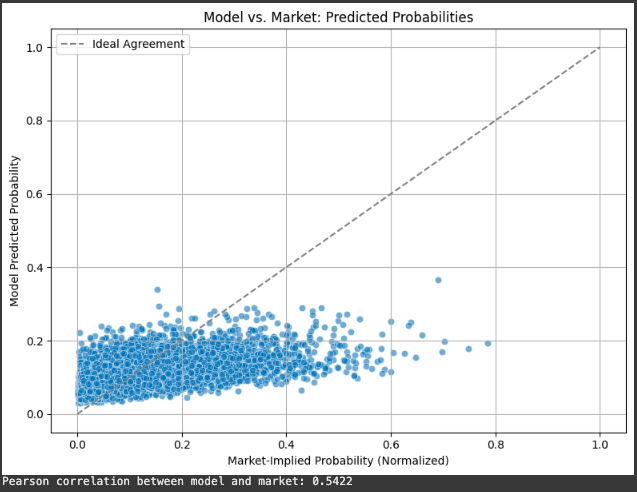
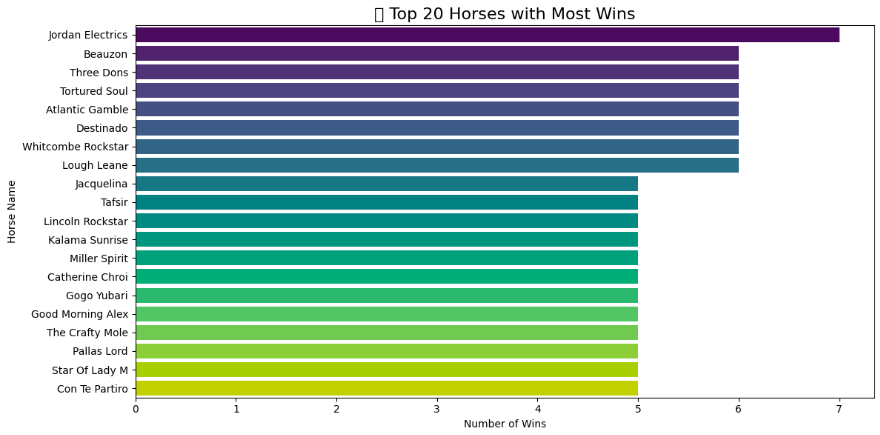

## 🏇 Predicting Winners: Probabilistic Modeling for Horse Races

### 🎯 Goal

The task was simple in principle but tricky in execution: for each horse in a race, predict the probability that it would win and ensure that all the probabilities in each race added up neatly to 1. This meant we weren’t just classifying winners and losers, we were estimating *how confident* we were in each horse’s chances.

---

### 🧠 Modeling Strategy: Start Simple, Build Smart

I started off by testing several machine learning models like : logistic regression, decision trees, random forests, and gradient boosting methods. At first, the results weren’t exciting. But when I applied **class-balanced weighting**, things started to change.

Why did this help? Well, in most races, only *one* horse wins, so there are far more examples of non-winners. Without correction, the model might just learn to always say “not a winner.” With **class-balanced weights**, we tell the model: *“Yes, winners are rare, but they’re important so give their examples more attention.”* Mathematically, this adjusts the loss function to weigh rare positive cases more heavily, making the model pay more attention to them.

Among all the models, **logistic regression** turned out to be the most stable and reliable, especially once we properly tuned it and scaled the features.

---

### 🔍 Feature Engineering: It’s All About Context

Initially, I explored all the available features and noticed something: **absolute performance (like a horse’s raw speed) wasn’t enough.** Races are relative battles. It’s not about how fast you are, it’s about whether you’re faster than your opponents *in that race*.

So I built **race-relative features**:

* `SpeedRel1` and `SpeedRel2`: The horse’s speed z-scored against others in the same race.
* `OddsRank1` and `OddsRank2`: The horse’s market odds rank.
* `TrainerRating_rel`: Trainer quality relative to the field.

These features gave the model real context—like telling it, *“This horse is above average today, even if it’s not fast on an absolute scale.”* It’s like saying Usain Bolt isn’t just fast—he’s fast *compared to everyone else on the track*.

I also encoded track conditions (`Going`) using a rank-based system (from Firm to Heavy) and used z-score normalization for numeric features to standardize across varying ranges.

---

### 🧪 From Raw Scores to Valid Probabilities

One tricky requirement was ensuring that the predicted probabilities for all horses in a race summed to **exactly 1**. That’s not something most classifiers naturally do. So after predicting raw probabilities with the model, I applied a **softmax transformation** : a mathematical function that turns a list of numbers into a valid probability distribution.

This meant:

* Higher-scoring horses still got higher probabilities,
* But now, the entire set of horses in a race had probabilities that added up to 1.

This transformation brought our predictions into line with how probabilities should behave in the real world.

---

### 📊 Evaluation: So, How Did It Perform?

To measure how well the model’s probabilities matched reality, I used two key metrics:

* **Log Loss**: Punishes confident wrong predictions more than uncertain ones.
* **Brier Score**: Measures the average squared difference between predicted probabilities and actual outcomes.

The best configuration (logistic regression with tuned parameters and softmax normalization) delivered:

| Metric                | Value  |
| --------------------- | ------ |
| **Log Loss**          | 0.3188 |
| **Brier Score**       | 0.0898 |
| **Balanced Accuracy** | 62.78% |
| **Sensitivity**       | 67.39% |
| **Specificity**       | 58.17% |

These results show a well-calibrated model—one that’s cautious where needed and confident when deserved.

---

### 🧩 Assumptions, Challenges, and Next Steps

There were some challenges along the way:

* **Missing data**: Some features had NaNs. Instead of filling everything with global averages (which could blur out a horse’s true identity), I imputed missing values based on *that horse’s own history*. This preserved individuality but may still need refinement for more context-based variables.
* **Feature granularity**: Some inputs, like trainer or sire ratings, may not be horse-specific enough. There's room to explore more dynamic features in the future.
* **Imbalance in winners**: Since there’s only one winner per race, training a model without accounting for this imbalance would skew results badly.

Future improvements could include:

* Adding features like “Top 50% finish rate” to provide a broader performance picture.
* Systematically comparing different scaling methods.
* Testing more expressive models (like gradient boosting) once the feature set is optimized.

---
### Some Additional Sections

### 📊 Model vs. Market: Predicted Probabilities

This scatter plot shows how the model's predicted win probabilities compare to those implied by the betting market. The dashed line represents perfect agreement—if every point fell on that line, it would mean the model and market completely agree.

In reality, most points fall below the line, meaning the model tends to predict lower win probabilities than the market does. Still, there's a clear upward trend: when the market thinks a horse has a higher chance of winning, the model usually agrees (to some extent). The **Pearson correlation of 0.5422** supports that there’s a meaningful relationship between the two.

**Why this matters:**
The market reflects collective opinion, money, and often experience—so it’s a strong benchmark. Matching it too closely might mean the model isn’t adding anything new. But some disagreement can be a good thing, it may suggest the model is spotting horses that the market is underestimating, which could lead to valuable betting opportunities.

---

### 🏆 Who’s Winning? A Look at Top Performers

This chart shows the top 20 horses with the most wins in the dataset. *Jordan Electrics* stands out with the highest number of wins, followed by several others that consistently perform well.

**Why this matters:**
This helps us sanity-check the model. If it's assigning high probabilities to horses like these (who actually win often), that's a strong sign it’s learning useful patterns. It also highlights horses that might be consistently beating expectations—possibly uncovering talent or conditions the market isn't pricing in correctly.

---

### 🏁 Final Thoughts

In horse racing, just like in life, context is everything. A horse’s raw ability is only half the story , how it stacks up *today* against *this field* on *this track* is what really matters.

This project reinforced how thoughtful feature engineering, careful evaluation, and respecting the structure of the problem (like probability summation) can turn a basic classifier into a powerful predictive tool.
